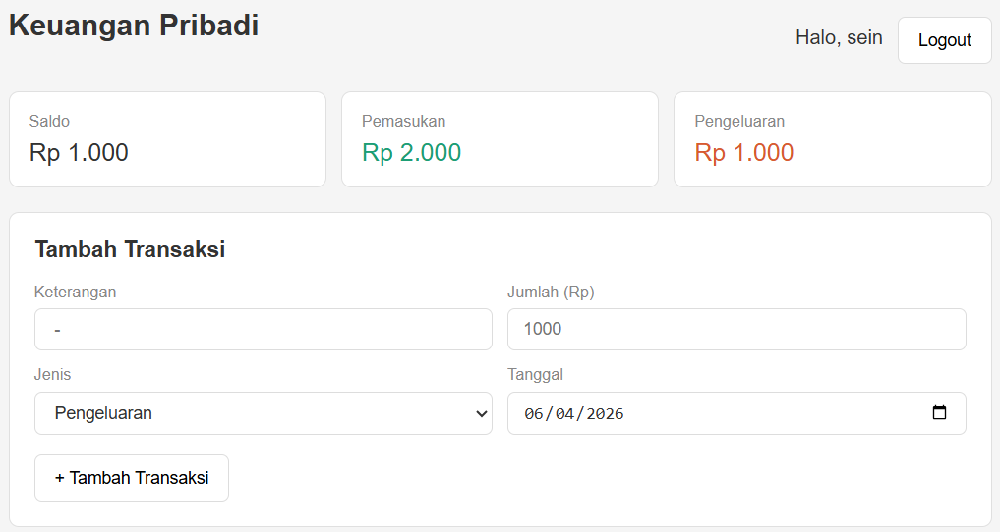
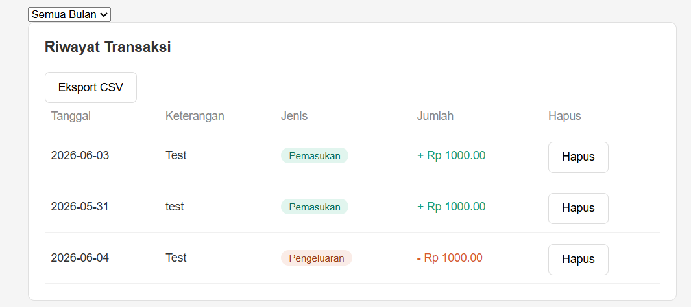
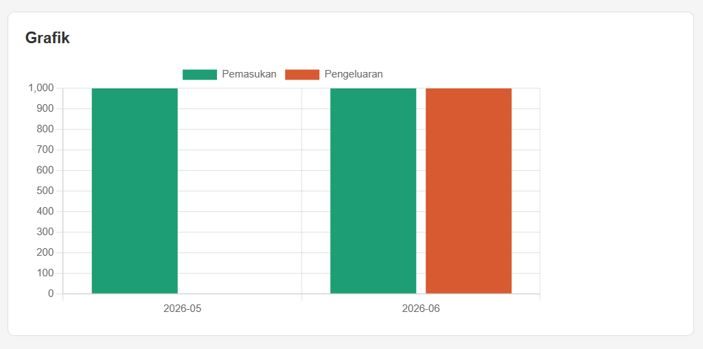

# Self_Note
# Catatan Keuangan

Aplikasi web untuk membantu mempermudah administrasi dalam keuangan pribadi.

## Demo
[Buka Aplikasi](https://persona6protagonist.github.io/project_selfnote/kicau_login.html)

## Fitur
- Register & login dengan autentikasi JWT
- Tambah & hapus transaksi (pemasukan / pengeluaran)
- Hitung saldo otomatis
- Filter transaksi per bulan
- Grafik keuangan per bulan
- Export transaksi ke CSV
- Data tersimpan per user

## Tech Stack
**Frontend:**
- HTML, CSS, JavaScript

**Backend:**
- Node.js
- Express.js
- JWT (JSON Web Token)
- bcrypt

**Database:**
- MySQL

**Deploy:**
- Frontend: GitHub Pages
- Backend: Railway

## Screenshot




## Cara Install (Local)

### Backend
```bash
cd belajar-node
npm install
cp .env.example .env
# isi nilai di .env
node index.js
```

### Frontend
Buka dengan Live Server di VS Code.